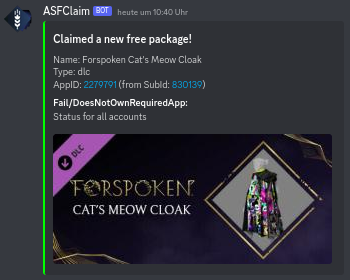
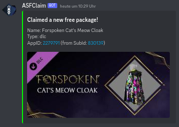
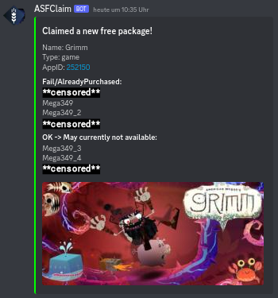

# ASFclaim

[DockerHub Repository](https://hub.docker.com/r/journeyover/asfclaim) | Forked from [C4illin/ASFclaim](https://github.com/C4illin/ASFclaim)

ASFclaim is a tool that automatically claims new free packages on [Steam](https://store.steampowered.com/) if available. It works in conjunction with [ArchiSteamFarm](https://github.com/JustArchiNET/ArchiSteamFarm) (ASF) with IPC enabled.

---

## Discord Webhook Integration (Optional)

### Successfully Claimed Game


### Claimed Package Containing a DLC (with or without status visibility)



### Claimed Game Package with Multiple Results and Visible Botnames
_Status 'OK' does not necessarily mean success; it might indicate that the game is no longer available, not yet released, or another issue has occurred._



When the status is hidden (`WEBHOOK_SHOWACCOUNTSTATUS=false`), bot names and status will not be displayed, which can be useful for public Discord channels.

---

## Installation

Create a `compose.yml` file with the following content:

```yaml
volumes:
    data:

services:
    asfclaim:
        image: journeyover/asfclaim:latest
        environment:
            - TZ=America/Chicago
            - ASF_PROTOCOL=http
            - ASF_HOST=localhost
            - ASF_PORT=1242
            - ASF_PASS=secret
            - ASF_COMMAND_PREFIX=!
            - ASF_BOTS=asf
            - ASF_CLAIM_INTERVAL=6
            - WEBHOOK_URL=none # replace with your Discord webhook URL
            - WEBHOOK_ENABLEDTYPES=error;warn;success # 'info' might be too verbose
            - WEBHOOK_SHOWACCOUNTSTATUS=true # set to 'false' if you don't want botnames exposed in Discord
        volumes:
            - data:/app/storage/
```

### Environment Variables

| ENV                         | Description                                 | Info                              | Default Value        | Required |
| --------------------------- | ------------------------------------------- | --------------------------------- | -------------------- | -------- |
| `TZ`                        | Your timezone                               | Timezone identifier (e.g., `Europe/Amsterdam`) | `Europe/Amsterdam`   | No       |
| `ASF_PROTOCOL`              | ASF-IPC Transfer protocol                   | Options: `http` or `https`        | `http`               | No       |
| `ASF_HOST`                  | ASF-IPC Hostname or IP                      | Hostname or IP address            | `localhost`          | No       |
| `ASF_PORT`                  | ASF-IPC Port                                | Port number for IPC               | `1242`               | No       |
| `ASF_PASS`                  | ASF-IPC Password                            | Plaintext password for ASF        | `secret`             | **Yes**  |
| `ASF_COMMAND_PREFIX`        | Command prefix for ASF                      | Prefix used before commands       | `!`                  | No       |
| `ASF_BOTS`                  | List of ASF bot names                       | Comma-separated bot names         | `asf`                | No       |
| `ASF_CLAIM_INTERVAL`        | Hours to wait for execution                 | Interval in hours between checks  | `6`                  | No       |
| `WEBHOOK_URL`               | Discord Webhook URL                         | URL for Discord webhook or `none` to disable | `none`               | No       |
| `WEBHOOK_ENABLEDTYPES`      | Displayed notification types in Discord chat | Semicolon-separated types (e.g., `error;warn;success`) | `error;warn;success` | No       |
| `WEBHOOK_SHOWACCOUNTSTATUS` | Show result from ASF                        | Options: `true` or `false`        | `true`               | No       |

---

## External Resources

- Webhook Bot Icon: [GitHub: ArchiSteamFarm](https://raw.githubusercontent.com/JustArchiNET/ArchiSteamFarm/main/resources/ASF_512x512.png)
- Webhook Placeholder Image: [placeholder.com](https://via.placeholder.com/460x215.jpg?text=Cant+load+image)
- Claimable Package List: [GitHub: C4illin Gist](https://gist.github.com/C4illin/e8c5cf365d816f2640242bf01d8d3675)
- Steam API
